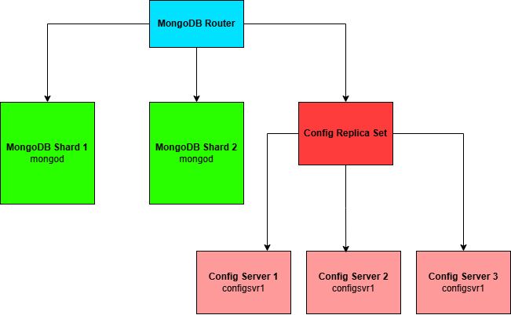

# 📡 Feed Management System with MongoDB Sharded Cluster

This project simulates the feed management backend of a social network using a **sharded MongoDB cluster**. It includes synthetic data generation, optimized sharding, and a suite of queries used in social networks — such as retrieving user posts, top liked posts, recent activity by friends, and more.

---

## 🧩 Problem Statement

Social networks often deal with:
- Millions of users
- Massive numbers of posts and interactions (likes, comments)
- High query loads (e.g., fetching friends' posts, trending topics)

A **single-node MongoDB instance** would struggle under such load, especially as data grows. To address **scalability and query performance**, we deploy a **sharded MongoDB cluster** that:
- Distributes data across multiple shards
- Supports horizontal scaling
- Minimizes read/write bottlenecks

---

## 🏗️ Cluster Architecture

We set up a local **MongoDB sharded cluster using Docker**, consisting of:


### Components:
- `mongos`: The query router
- `shardsvr`: Two shards for data storage
- `configsvr`: Three nodes for storing cluster metadata

---

## ⚙️ Setup Instructions

### 1. Clone Repository and Start Docker Cluster
```bash
git clone https://github.com/your-repo/feed-sharded-cluster.git
cd feed-sharded-cluster
docker-compose up -d
```

### 2. Initialize Config Servers
```bash
docker exec -it mongodb-configsvr1-1 mongosh --eval '
rs.initiate({
  _id: "configReplSet",
  configsvr: true,
  members: [
    {_id: 0, host: "configsvr1:27017"},
    {_id: 1, host: "configsvr2:27017"},
    {_id: 2, host: "configsvr3:27017"}
  ]
})
'
```

### 3. Initialize Shard Replica Sets
#### Run these commands for each shard container:
```bash
docker exec -it mongodb-shard1-1 mongosh --eval '
rs.initiate({
  _id: "shard1ReplSet",
  members: [{_id: 0, host: "shard1:27017"}]
})
'

docker exec -it mongodb-shard2-1 mongosh --eval '
rs.initiate({
  _id: "shard2ReplSet",
  members: [{_id: 0, host: "shard2:27017"}]
})
'
```

### 4. Add Shards to Router
```bash
docker exec -it mongodb-router-1 mongosh --eval '
sh.addShard("shard1ReplSet/shard1:27017");
sh.addShard("shard2ReplSet/shard2:27017");
'
```

### 5. Enable Sharding and Configure Shard Keys
```bash
docker exec -it mongodb-router-1 mongosh --eval '
sh.enableSharding("social_network");

// Shard users on _id (even distribution)
sh.shardCollection("social_network.users", { _id: "hashed" });

// Shard posts on user_id (query isolation per user)
sh.shardCollection("social_network.posts", { user_id: 1 });

// Shard comments on post_id (grouped per post)
sh.shardCollection("social_network.comments", { post_id: 1 });

// Shard likes on post_id (grouped per post)
sh.shardCollection("social_network.likes", { post_id: 1 });

// Shard friendships on user_id (queries by user)
sh.shardCollection("social_network.friendships", { user_id: 1 });
'
```

## 🧠 Why these shard keys ? 

| Collection    | Shard Key         | Reasoning                                    |
| ------------- | ----------------- | -------------------------------------------- |
| `users`       | `{_id: "hashed"}` | Evenly distributes users                     |
| `posts`       | `{user_id: 1}`    | User-specific queries (e.g. feed, top posts) |
| `comments`    | `{post_id: 1}`    | Most comments are fetched per post           |
| `likes`       | `{post_id: 1}`    | Likes are always queried by post             |
| `friendships` | `{user_id: 1}`    | All friend lookups are based on the user     |

## 🚀 How These Shard Keys Improve Performance
✅ Parallelism: Shard keys allow MongoDB to query only the shards that contain relevant data.

✅ Isolation: User-centric keys isolate reads/writes for one user to a small subset of the cluster.

✅ Balanced Load: Hashed shard keys on users ensure no single shard holds too many documents.

✅ Minimized Scatter-Gather: Topic-level or user-level queries avoid scanning all shards.

For example:

- `get_all_posts_of_user(user_id)` hits just one shard (posts are sharded on user_id)
- `get_all_comments_of_user(user_id)` is fast because comment inserts and lookups are localized by post_id

## 🧪 Running Queries and Generating Results
```bash
# Run the dataset generator
python generate_data.py

# Run the query script — output stored in query_results/
python run_queries.py
```
